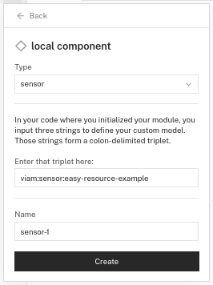

# easy_resource

This is an example using the `EasyResource` mixin, a helper for creating Viam modules.

## Instructions

### Run standalone in this directory

If you know how to set up a python virtualenv, do that first to give yourself an isolated environment. (If not, it's okay to proceed without it).

```sh
# install the SDK
pip install viam-sdk
# or if you plan to edit the SDK: `pip install -e ../..`

# run the module
./main.py socket-path

# Ctrl-C the running process when you're done
```

Running it this way won't do anything interesting, but it's a quick way to ensure your module can boot.

### Run with viam-server

If you are running viam-server on your laptop, you can use easy_resource as a module.

```sh
# first, build a binary for the module:
pip install pyinstaller
make dist/main
```

Then, in the Viam config builder for your machine:
1. Add a local module with executable path `/PATH/TO/REPO/examples/easy_resource/dist/main`. (Replace `/PATH/TO/REPO`).
1. Then add a local component with type 'sensor' and triplet 'viam:sensor:easy-resource-example' (see screenshot).
1. Save, then go to the control page to interact with the sensor.

Screenshot of 'local component' screen:


